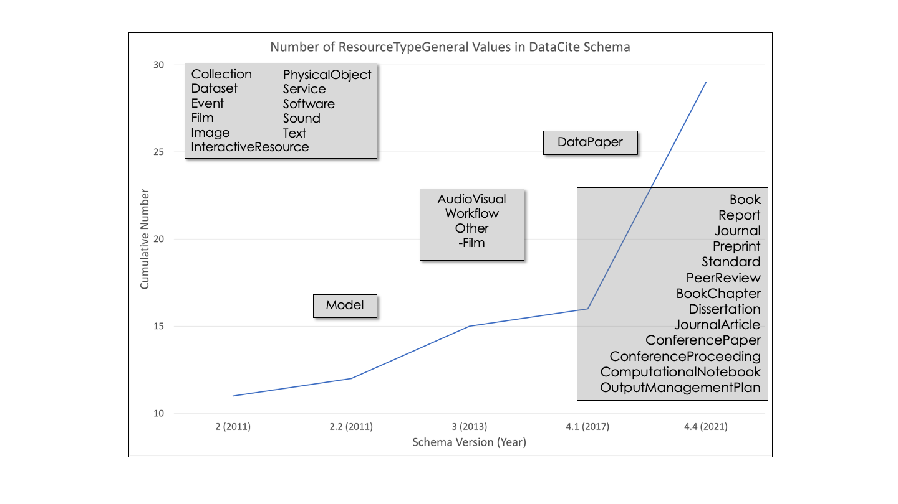

# DataCite Facets
The [DataCite Metadata Schema](https://schema.datacite.org/meta/kernel-4.4/) has [evolved considerably](https://metadatagamechangers.com/blog/2021/1/11/fair-datacite-metadata-evolution) over more than a decade and now includes a variety of metadata elements, resource types, related resources, and contributor types in millions of metadata records from over 2000 repositories. The DataCite Metadata Working Group has overseen this evolution and works with DataCite members and the DataCite Board to chart the path forward for the metadata schema. Understanding how DataCite metadata is currently being used provides critical background for this group. 

A facet is a metadata element, usually from a controlled list, that provides counts of records in a query result with particular values for the metadata element. The [DataCite JSON Response](https://blog.datacite.org/introducing-datacite-json/) includes data on a variety of facets for each query done using the DataCite API. This tool retrieves those facets for a variety of queries and summarizes the results.

# Usage
**Use python retrieveDataCiteFacets.py -h to see this usage description.**

```
usage: retrieveDataCiteFacets [-h] [-al [AFFILIATIONLIST ...]] [-il [ITEMLIST ...]] [-fl [FACETLIST ...]] [--contributors] [--relations] [--resources] [--showURLs] [--showtargets] [--csvout]
                              [--dbout] [--facetdata] [--htmlout] [--jout] [--pout] [--loglevel {debug,info,warning}] [--logto FILE]

Use DataCite API to retrieve metadata records for given relationType, resourceType, contributorType, and affiliations from DataCite. Save the retrieved metadata into json files (--jout) and facet
data into csv or html file or database (defined in environment).

options:
  -h, --help            show this help message and exit
  -al [AFFILIATIONLIST ...], --affiliationList [AFFILIATIONLIST ...]
                        space separated list of affiliations to retrieve (affiliations with spaces in quotes)
  -il [ITEMLIST ...], --itemList [ITEMLIST ...]
                        space separated list of items to retrieve
  -fl [FACETLIST ...], --facetList [FACETLIST ...]
                        Select space separated list of facets to retrieve from: states resourceTypes created published registered providers clients affiliations prefixes certificates licenses
                        schemaVersions linkChecksStatus subjects fieldsOfScience citations views downloads. Default = all
  --contributors        Retrieve facets for all contributorTypes: ContactPerson, DataCollector, DataCurator, DataManager, Distributor, Editor, HostingInstitution, Other, Producer, ProjectLeader,
                        ProjectManager, ProjectMember, RegistrationAgency, RegistrationAuthority, RelatedPerson, ResearchGroup, RightsHolder, Researcher, Sponsor, Supervisor, WorkPackageLeader
  --relations           Retrieve facets for all relations: IsCitedBy, Cites, IsSupplementTo, IsSupplementedBy, IsContinuedBy, Continues, IsNewVersionOf, IsPreviousVersionOf, IsPartOf, HasPart,
                        IsPublishedIn, IsReferencedBy, References, IsDocumentedBy, Documents, IsCompiledBy, Compiles, IsVariantFormOf, IsOriginalFormOf, IsIdenticalTo, HasMetadata, IsMetadataFor,
                        Reviews, IsReviewedBy, IsDerivedFrom, IsSourceOf, Describes, IsDescribedBy, HasVersion, IsVersionOf, Requires, IsRequiredBy, Obsoletes, IsObsoletedBy
  --resources           Retrieve facets for all resource types: Audiovisual, Book, BookChapter, Collection, ComputationalNotebook, ConferencePaper, ConferenceProceeding, DataPaper, Dataset,
                        Dissertation, Event, Image, InteractiveResource, Journal, JournalArticle, Model, OutputManagementPlan, PeerReview, PhysicalObject, Preprint, Report, Service, Software, Sound,
                        Standard, Text, Workflow, Other
  --showURLs            Show URLs that will be retrieved but DO NOT retrieve metadata
  --showtargets         Show target lists (e.g. all resourceTypes, relationTypes, contributorTypes)
  --csvout              Output results in CSV file
  --dbout               Output results in database (requires sqlite3 package)
  --facetdata           Create dataframe from facet data
  --htmlout             Output results in HTML file
  --jout                Output retrieved metadata in json files
  --pout                Output facet counts to terminal (requires tabulate package https://pypi.org/project/tabulate/)
  --loglevel {debug,info,warning}
                        Logging level for logging module (https://docs.python.org/3/howto/logging.html#useful-handlers)
  --logto FILE          Log file (will append to file if exists)
```

# Environment
The environment definition for this application is in *dataCiteFacets.yml*. This file can be used to create the environment using the command *conda env create -f environment.yml*. After that environment is created, activate it using the *conda activate dataCiteFacets* command and the command *retrieveDataCiteFacets -h* will show the usage description.

# Targets and Items
RetrieveDataCiteFacets is designed to answer questions about several kinds of *targets*, specifically resourceTypes, relationTypes, contributorTypes, or creator affiliations (a special case). *Targets* are groups of *items* defined by DataCite codelists. To see the *items* included in each *target*, use the --showtargets flag to display all *target items*.  

**python retrieveDataCiteFacets.py --showtargets**

Target: relations  
['IsCitedBy', 'Cites', 'IsSupplementTo', 'IsSupplementedBy', 'IsContinuedBy', 'Continues', 'IsNewVersionOf', 'IsPreviousVersionOf', 'IsPartOf', 'HasPart', 'IsPublishedIn', 'IsReferencedBy', 'References', 'IsDocumentedBy', 'Documents', 'IsCompiledBy', 'Compiles', 'IsVariantFormOf', 'IsOriginalFormOf', 'IsIdenticalTo', 'HasMetadata', 'IsMetadataFor', 'Reviews', 'IsReviewedBy', 'IsDerivedFrom', 'IsSourceOf', 'Describes', 'IsDescribedBy', 'HasVersion', 'IsVersionOf', 'Requires', 'IsRequiredBy', 'Obsoletes', 'IsObsoletedBy']

Target: resources  
['Audiovisual', 'Book', 'BookChapter', 'Collection', 'ComputationalNotebook', 'ConferencePaper', 'ConferenceProceeding', 'DataPaper', 'Dataset', 'Dissertation', 'Event', 'Image', 'InteractiveResource', 'Journal', 'JournalArticle', 'Model', 'OutputManagementPlan', 'PeerReview', 'PhysicalObject', 'Preprint', 'Report', 'Service', 'Software', 'Sound', 'Standard', 'Text', 'Workflow', 'Other']

Target: contributors  
['ContactPerson', 'DataCollector', 'DataCurator', 'DataManager', 'Distributor', 'Editor', 'HostingInstitution', 'Other', 'Producer', 'ProjectLeader', 'ProjectManager', 'ProjectMember', 'RegistrationAgency', 'RegistrationAuthority', 'RelatedPerson', 'ResearchGroup', 'RightsHolder', 'Researcher', 'Sponsor', 'Supervisor', 'WorkPackageLeader']

Target: affiliations  
Affiliations set from command line -al option with space separated list of affiliations to retrieve (affiliations with spaces in quotes).

Facets 
['states', 'resourceTypes', 'created', 'published', 'registered', 'providers', 'clients', 'affiliations', 'prefixes', 'certificates', 'licenses', 'schemaVersions', 'linkChecksStatus', 'subjects', 'fieldsOfScience', 'citations', 'views', 'downloads']


# Outputs
As described above, the facet results are returned from the query as a list of dictionaries that include ids, titles, and values. As an example, this is the list of dictionaries for clients (repositories) that use the PhysicalObject resourceType:

```
"clients": [
    {"id": "fao.itpgrfa", "title": "International Treaty on Plant Genetic Resources for Food and Agriculture", "count": 1084243},
    {"id": "ipk.gbis", "title": "Genebank Information System of the IPK Gatersleben", "count": 208740},
    {"id": "inist.inra", "title": "Data INRAE", "count": 67518},
    {"id": "tcd.digcolls", "title": "Digital Collections", "count": 10299},
    {"id": "inist.humanum", "title": "NAKALA", "count": 9286},
    {"id": "ubc.oc", "title": "Open Collections", "count": 3720},
    {"id": "subgoe.vzg", "title": "Verbundzentrale des GBV", "count": 3142},
    {"id": "inist.inra", "title": "Institut national de recherche pour l’agriculture, l’alimentation et l’environnement", "count": 1435},
    {"id": "inist.ulille", "title": "Université de Lille", "count": 1200},
    {"id": "cern.zenodo", "title": "Zenodo", "count": 986}
]
```

The json query responses can be saved directly using the **json output (-jout)** flag described below. The goal of this tool is to provide facet information in an easy-to-use form. As a step towards that goal, a few summary statistics are calculated from these data (with examples from the PhysicalObject result):

|Statistic|Definition|Value
|:-------- |:------| :--------: |
|number|The number of clients|10|
|max|The maximum number of resources for any client|1084243|
|common|The client with the most resources|fao.itpgrfa|
|total|The total number of resources in the top 10|1390569|
|homogeneity|An indicator of homogeneity of the list (0.1 = uniform, 1.0 = single item)|78%|
|coverage|The % of all records in the query result covered by the top 10 (numbers close to 100% are good)|

## Terminal Output
As the program runs the python logging package is used to provide timestamps as well as information about queries that are being run and the number of results.

```
2022-05-13 16:57:52:INFO:retrieveDataCiteFacets: *********************************** python retrieveDataCiteFacets.py 20220513_16
2022-05-13 16:57:52:INFO:retrieveDataCiteFacets: Targets: ['contributors', 'resources', 'resources']
2022-05-13 16:57:55:INFO:retrieveDataCiteFacets: Count: 1 target: contributors URL: https://api.datacite.org/dois?query=contributors.contributorType:DataManager Number of records: 944221
2022-05-13 16:57:57:INFO:retrieveDataCiteFacets: Count: 2 target: resources URL: https://api.datacite.org/dois?&page[size]=1&resource-type-id=Book Number of records: 15086
2022-05-13 16:57:58:INFO:retrieveDataCiteFacets: Count: 3 target: resources URL: https://api.datacite.org/dois?&page[size]=1&resource-type-id=InteractiveResource Number of records: 31889
```

## --showURLs
The --showURLs flag can be used to display the URLs that will be retrieved for a given set of flags without retrieving the data. This can be used for testing or if you are curious about how the queries are done.

## File Output

Each DataCite API queries returns data for 18 facets covering many aspects of DataCite usage. The inclusion of these statistics for each facet leads to 90 pieces of data for each item. There are several ways to output these data after they are retrieved with output choices made using command line flags:

| Flag  | Output Format |
|:-------- |:------|
| --csvout | Output the data as comma-separated values (csv) into a file named *DataCite\_target1_target2\_\_dateStamp.csv* where taregt1\_target2 is an underscore separated list of the targets being retrieved. Each row contains three header columns (item id, DateTime (YYYYMMDD\_HH), and NumberOfRecords in complete query result) and then five columns/facet with names that correspond to the statistics described above. The names have the form facet\_statistic do, for the clients facet, the columns are clients\_number, clients\_max, clients\_common, clients\_total, clients\_HI, and clients (a string representation of the result).|
| --dbout |Output the data into a sqlite database in a file defined by the environment variable DATACITE\_STATISTICS\_DATABASE. The name of the database table is given by the variable _databaseTableName_. The structure of this query is defined in *createTable.sql*.|
| --facetdata |Output facet data (i.e. counts/facet) into an HTML file named *DataCite\_target1_target2\_facet\_\_dateStamp.csv*.|
| --htmlout |Output the data into an HTML file named *DataCite\_target1_target2\_\_dateStamp.csv*. Maximum values in each column are highted green and the \_HI colum is highlighted red for values < 0.000005, green for values > 0.99999, or yellow for other values.|
|--pout|This option writes output to the terminal in the format of a github markdown table using the *tabulate* python package. This format is unusable in most cases, but it can provide an easy quick look for limited query results.|
|--jout|This option writes the json query results into files in the directory *homeDir/data/DataCite/metadata/target__dateStamp/json. The files are named item.json with spaces replaced by '\_'.|

# Selecting items

##Command line options provide shortcuts to select all of the items in a target:
| Flag  | Selection|
|:-------- |:------|
|--contributors | query all contributorTypes|
|--relations | query all relationTypes|
|--resources | query all resourceTypes|

## Select items from different targets
Sometimes it is hard to remember what kind of target a particular target is or you might need a small selection of items from several targets to answer some interesting questions. In this case, use the item list (-il) option. For example **python retrieveDataCiteFacets.py -il DataManager InteractiveResource Book** retrieves facet counts for records that have contributorType="Data Manager" or "resourceTypeGeneral="InteractiveResource" or "resourceTypeGeneral="Books".  

*Keep in mind that these three criteria are completely independent, these are all separate queries.*

## Selecting Affiliations
The affiliations target is special because it is controlled by specific user needs rather than a DataCite controlled vocabulary. It was designed to enable discovery of where DataCite resources with affiliations for particular organizations were published. Using this option requires specifying your own space separated list of affiliations to retrieve (affiliations with spaces in quotes).

# Selecting facets
Each DataCite API queries returns data for 18 facets covering many aspects of DataCite usage. Many times this can cause information overload! If you are answering specific questions, you may need only a small number of these facets. For example, if you are only interested in the number of records, the "states" facet is all you need: **python retrieveDataCiteFacets.py -il DataManager InteractiveResource Book -fl states --pout** gives the small result:  

| Id                  |    DateTime |   NumberOfRecords |   states_number |   states_max | states_common   |   states_total |   states_HI | states            |
|---------------------|-------------|-------------------|-----------------|--------------|-----------------|----------------|-------------|-------------------|
| DataManager         | 20220513_16 |            944221 |               1 |       944221 | findable        |         944221 |           1 | Findable (944221) |
| Book                | 20220513_16 |             15086 |               1 |        15086 | findable        |          15086 |           1 | Findable (15086)  |
| InteractiveResource | 20220513_16 |             31889 |               1 |        31889 | findable        |          31889 |           1 | Findable (31889)  |

Which shows that there are nearly 1 million Data Managers referenced in DataCite metadata. 

_Bonus Question_: There are actually three related contributor types: DataCollector, DataCurator, DataManager. How does usage of these compare?

**python retrieveDataCiteFacets.py -il DataCollector DataCurator DataManager -fl states --pout**.  

| Id            |    DateTime |   NumberOfRecords |   states_number |   states_max | states_common   |   states_total |   states_HI | states            |
|---------------|-------------|-------------------|-----------------|--------------|-----------------|----------------|-------------|-------------------|
| DataCollector | 20220513_17 |            886529 |               1 |       886529 | findable        |         886529 |           1 | Findable (886529) |
| DataCurator   | 20220513_17 |            137177 |               1 |       137177 | findable        |         137177 |           1 | Findable (137177) |
| DataManager   | 20220513_17 |            944238 |               1 |       944238 | findable        |         944238 |           1 | Findable (944238) |

# Examples
So, how can these facet data be used to answer questions about DataCite metadata? One interesting question is “How do DataCite metadata evolve?”. An interesting test case for this question occurred with the introduction of Version 4.4 of the DataCite Schema during early 2021. That version of the schema included thirteen new resource types in the resourceTypeGeneral codelist, a required field (Figure 1). 

The history of usage of these resource types in DataCite can be examined using the "registered" facet and this command:  
**python retrieveDataCiteFacets -il Book Report Journal Preprint Standard PeerReview BookChapter Dissertation JournalArticle ConferencePaper ConferenceProceeding ComputationalNotebook OutputManagementPlan  -fl registered  --pout --csvout**

which produces the file *DataCite\_resources_\_\YYYYMMDD\_HH.csv* and this ugly table:

| Id                    |    DateTime |   NumberOfRecords |   registered_number |   registered_max |   registered_common |   registered_total |   registered_HI | registered                                                                                                                        |
|-----------------------|-------------|-------------------|---------------------|------------------|---------------------|--------------------|-----------------|-----------------------------------------------------------------------------------------------------------------------------------|
| Book                  | 20220515_13 |             15109 |                  10 |             6295 |                2021 |              14532 |        0.433182 | 2022 (4162), 2021 (6295), 2020 (596), 2019 (453), 2018 (1098), 2017 (904), 2016 (623), 2015 (370), 2014 (9), 2013 (22)            |
| BookChapter           | 20220515_13 |             10852 |                  10 |             7456 |                2021 |              10852 |        0.687062 | 2022 (2584), 2021 (7456), 2020 (62), 2019 (31), 2018 (28), 2017 (100), 2016 (200), 2015 (97), 2012 (289), 2011 (5)                |
| ComputationalNotebook | 20220515_13 |                10 |                   3 |                6 |                2021 |                 10 |        0.6      | 2022 (3), 2021 (6), 2019 (1)                                                                                                      |
| ConferencePaper       | 20220515_13 |             22656 |                   9 |            12105 |                2022 |              22654 |        0.534343 | 2022 (12105), 2021 (10174), 2020 (166), 2019 (69), 2018 (20), 2017 (36), 2016 (8), 2015 (7), 2013 (69)                            |
| ConferenceProceeding  | 20220515_13 |               847 |                  10 |              288 |                2020 |                738 |        0.390244 | 2022 (124), 2021 (144), 2020 (288), 2019 (8), 2018 (10), 2017 (36), 2016 (89), 2015 (28), 2014 (6), 2013 (5)                      |
| Dissertation          | 20220515_13 |             62652 |                  10 |            31784 |                2022 |              62641 |        0.507399 | 2022 (31784), 2021 (14607), 2020 (16200), 2019 (11), 2018 (10), 2017 (16), 2016 (4), 2015 (2), 2014 (5), 2013 (2)                 |
| Journal               | 20220515_13 |               372 |                   3 |              293 |                2021 |                372 |        0.787634 | 2022 (71), 2021 (293), 2020 (8)                                                                                                   |
| JournalArticle        | 20220515_13 |            176062 |                  10 |            96410 |                2022 |             173734 |        0.554929 | 2022 (96410), 2021 (66600), 2020 (976), 2019 (569), 2018 (230), 2017 (1949), 2016 (6404), 2015 (14), 2014 (580), 2012 (2)         |
| OutputManagementPlan  | 20220515_13 |               955 |                   4 |              524 |                2021 |                955 |        0.548691 | 2022 (233), 2021 (524), 2020 (135), 2019 (63)                                                                                     |
| PeerReview            | 20220515_13 |               291 |                   2 |              270 |                2021 |                291 |        0.927835 | 2022 (21), 2021 (270)                                                                                                             |
| Preprint              | 20220515_13 |            928793 |                   5 |           927425 |                2022 |             928782 |        0.998539 | 2022 (927425), 2021 (1299), 2020 (34), 2019 (13), 2018 (11)                                                                       |
| Report                | 20220515_13 |             81949 |                  10 |            10041 |                2021 |              59084 |        0.169944 | 2022 (5816), 2021 (10041), 2020 (4487), 2019 (5100), 2018 (5131), 2017 (6569), 2016 (8356), 2015 (4979), 2014 (3926), 2013 (4679) |
| Standard              | 20220515_13 |              2146 |                   7 |             1337 |                2022 |               2146 |        0.62302  | 2022 (1337), 2021 (578), 2020 (6), 2019 (213), 2018 (3), 2017 (7), 2016 (2)                                                       |


The “registered” facet data for these resource types reveal several interesting patterns:  

1. The new resource types have been used over 1.3 million times.
1. Most of the types were assigned to items registered over ten years (num-ber = 10), indicating that repositories updated previously registered DOIs with new types (an important prerequisite for metadata evolution).
1. Preprint is by far the most used of the new types, accounting for 71% of the items.
1. The vast majority of preprint DOIs (928,772) were registered during 2022.
1. Repositories have already registered more items with five new types (ConferencePaper, Dissertation, JournalArticle, Preprint, Standard) during 2022 than during any other year.

These data immediately lead to a second question: “Which repositories are us-ing these new resource types?”. That question can be answered using the command:  
**python retrieveDataCiteFacets -il Book Report Journal Preprint Standard PeerReview BookChapter Dissertation JournalArticle ConferencePaper ConferenceProceeding ComputationalNotebook OutputManagementPlan  -fl clients  --csvout --pout**
which produces the file *DataCite\_resources_\_\YYYYMMDD\_HH.csv* and this ugly table:

| Id                    |    DateTime |   NumberOfRecords |   clients_number |   clients_max | clients_common   |   clients_total |   clients_HI | clients                                                                                                                                                                                                                                                                                                                                                                                                                                                 |
|-----------------------|-------------|-------------------|------------------|---------------|------------------|-----------------|--------------|---------------------------------------------------------------------------------------------------------------------------------------------------------------------------------------------------------------------------------------------------------------------------------------------------------------------------------------------------------------------------------------------------------------------------------------------------------|
| Book                  | 20220515_13 |             15109 |               10 |          6421 | tib.tib          |           14686 |     0.437219 | TIB Hannover (6421), Zenodo (5458), peDOCS (2060), Università degli Studi di Napoli Federico II (228), Presses Universitaires Savoie Mont Blanc (222), RIA-UA (99), Universidade Católica Portuguesa (71), Libera Università di Bolzano (54), Escuela Internacional de Negocios y Desarrollo Empresarial de Colombia - EIDEC (43), innsbruck university press (30)                                                                                      |
| BookChapter           | 20220515_13 |             10852 |               10 |          5017 | mjvh.pedocs      |           10325 |     0.485908 | peDOCS (5017), Zenodo (3872), Alfred Wegener Institute (346), TIB Hannover (307), innsbruck university press (215), Libera Università di Bolzano (177), Universidade Católica Portuguesa (134), Polska Platforma Medyczna (125), Wydawnictwo Politechniki Łódzkiej (69), DIGITUMA (63)                                                                                                                                                                  |
| ComputationalNotebook | 20220515_13 |                10 |                4 |             4 | jbru.cist        |              10 |     0.4      | Fédération de recherche CIST - Collège international des sciences territoriales (4), Huma-Num (3), University of Luxembourg (2), DataCite (1)                                                                                                                                                                                                                                                                                                           |
| ConferencePaper       | 20220515_13 |             22656 |               10 |         18606 | cern.zenodo      |           22456 |     0.828554 | Zenodo (18606), German Medical Science (2746), University of New South Wales (421), TIB Hannover (201), Eurographics (144), Deutscher Verband für Materialforschung und -prüfung e.V. (126), University of Massachusetts (UMass) Amherst (71), pub H-BRS - Publikationsserver der Hochschule Bonn-Rhein-Sieg (50), Aalto University (46), TU Delft Research Repository (45)                                                                             |
| ConferenceProceeding  | 20220515_13 |               847 |               10 |           583 | tib.tib          |             796 |     0.732412 | TIB Hannover (583), Università degli Studi di Pisa (61), University of Texas Libraries (32), Leibniz Institute of Ecological Urban and Regional Development (29), Université de technologie de Compiègne (21), Instituto Politécnico do Porto (19), Data INRAE (15), UC Santa Barbara (14), Repositório Aberto da Universidade do Porto (11), Washington State University (11)                                                                          |
| Dissertation          | 20220515_13 |             62652 |               10 |         22109 | unsw.repo        |           61510 |     0.359437 | University of New South Wales (22109), Universitätsbibliothek der LMU (17921), Repositorio Institucional E-docUR (6942), Aston Publications Explorer (4804), STAX (4648), University of Massachusetts (UMass) Amherst (2720), Polska Platforma Medyczna (1156), Washington University in St. Louis Libraries (468), UKnowledge (379), TU Delft Research Repository (363)                                                                                |
| Journal               | 20220515_13 |               372 |               10 |           109 | zjrp.depp        |             285 |     0.382456 | Direction de l’évaluation; de la prospective et de la performance (109), Royal Botanic Gardens; Kew (92), Lusíada - Repositório das Universidades Lusíada (13), iMex. México Interdisciplinario / Interdisciplinary Mexico (13), Aspekty Muzyki (12), Università del Piemonte orientale “Amedeo Avogadro” (11), Universitätsbibliothek Eichstätt-Ingolstadt (9), James Cook University (9), mdwRepository (9), Université Paul-Valéry Montpellier 3 (8) |
| JournalArticle        | 20220515_13 |            176080 |               10 |        145339 | cern.zenodo      |          170941 |     0.850229 | Zenodo (145339), peDOCS (14471), Stanford Social Innovation Review (5826), Alfred Wegener Institute (3093), innsbruck university press (649), Entrepôt pour orphelin (420), Aalto University (377), NumeRev (354), Akofena (221), unipub (191)                                                                                                                                                                                                          |
| OutputManagementPlan  | 20220515_13 |               955 |                4 |           537 | cern.zenodo      |             955 |     0.562304 | Zenodo (537), California Digital Library (415), SOCIB (2), CDI B2Share (1)                                                                                                                                                                                                                                                                                                                                                                              |
| PeerReview            | 20220515_13 |               291 |                6 |           182 | inist.humanum    |             291 |     0.62543  | Huma-Num (182), NAKALA (100), Polskie Towarzystwo Logopedyczne (6), bonndoc (1), Tampa Repository (1), HEE Journal - The Journal of Health; Environment; and Education (1)                                                                                                                                                                                                                                                                              |
| Preprint              | 20220515_13 |            928793 |               10 |        926112 | arxiv.content    |          928779 |     0.997128 | **arXiv (926112), Zenodo (2565), NAKALA (46), Otto-von-Guericke-Universität Magdeburg (15), University of Massachusetts (UMass) Amherst (14), Oroboros Instruments (10), Institut national d'études démographiques (5), ISCPSI - Instituto Superior de Ciências Policiais e Segurança Interna (4), Materials Data Repository (4), Washington University in St. Louis Libraries (4)**                                                                        |
| Report                | 20220515_13 |             81949 |               10 |         66653 | tib.tib          |           80485 |     0.828142 | TIB Hannover (66653), Zenodo (7778), Alfred Wegener Institute (2568), CL Technical Reports (964), Libra (902), University of New South Wales (587), National Research Council Canada (336), Open Society Foundations (282), IOC of UNESCO (Intergovernmental Oceanographic Commission) (209), RIVM - Rijksinstituut voor Volksgezondheid en Milieu (206)                                                                                                |
| Standard              | 20220515_13 |              2146 |                6 |          1848 | univie.valep     |            2146 |     0.861137 | VALEP (1848), National Research Council Canada (294), Royal Botanic Gardens; Kew (1), NASA Space Physics Data Facility (SPDF) (1), Institut national de recherche pour l’agriculture; l’alimentation et l’environnement (1), Central Lancashire Online Knowledge (1)   

It is immediately clear that arXiv.common dominates the usage of the Preprint resource in DataCite with 926,112 of 928,723 registered items. Similar behavior is not unusual. The homogeneity index (HI) column shows that a single repository is responsible for over 80% of the usage of five of the thirteen new types (Preprint, Standard, JournalArticle, ConferencePaper, and Report).  

---
<a rel="license" href="http://creativecommons.org/licenses/by-nc-sa/4.0/"></a><br /><span xmlns:dct="http://purl.org/dc/terms/" href="http://purl.org/dc/dcmitype/Text" property="dct:title" rel="dct:type">DataCiteFacets</span> by <a xmlns:cc="http://creativecommons.org/ns#" href="metadatagamechangers.com" property="cc:attributionName" rel="cc:attributionURL">Ted Habermann</a> is licensed under a <a rel="license" href="http://creativecommons.org/licenses/by-nc-sa/4.0/">Creative Commons Attribution-NonCommercial-ShareAlike 4.0 International License</a>.